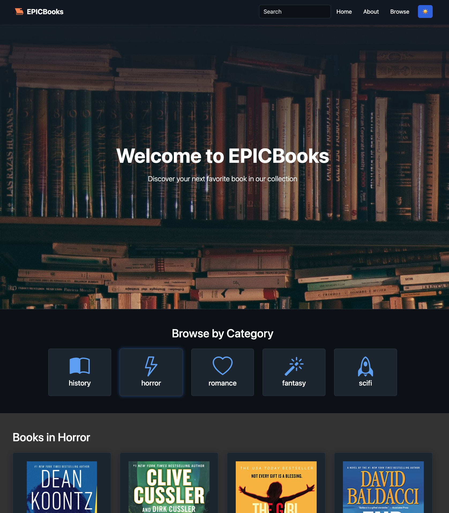

# 📚 EPICBooks

Welcome to **EPICBooks**, my ultimate online bookstore built with React and Vite, where I offer a vast selection of literature across various genres. This platform makes searching, browsing, and exploring books easy and enjoyable for everyone.

> 🌐 Experience EPICBooks in action: [Click here to visit our live demo](https://5-react-js-ch-2.vercel.app/)


## 🚀 React + Vite Setup

This template provides a minimal setup to get React working in Vite with HMR and some ESLint rules.

Currently, two official plugins are available:

- [@vitejs/plugin-react](https://github.com/vitejs/vite-plugin-react/blob/main/packages/plugin-react/README.md) uses [Babel](https://babeljs.io/) for Fast Refresh
- [@vitejs/plugin-react-swc](https://github.com/vitejs/vite-plugin-react-swc) uses [SWC](https://swc.rs/) for Fast Refresh

## 📌 Main Features

### 🌗 Theme Support
- Dark mode by default with light mode toggle option
- Smooth theme transitions
- Theme-aware components and modals
- Persistent theme selection
- Enhanced dark theme consistency across all pages
- Dark background for About and BookDetails sections
- Improved theme transitions and color schemes

### ✅ Category Navigation
Browse books by different categories including History, Horror, Romance, Fantasy, and Sci-Fi.

### 🖼️ Book Cards with Interactive Selection
- Visually appealing book cards displaying essential details and pricing information
- Red border highlight when a book is selected
- Smooth hover effects for better user interaction
- "See Details" button for each book
- Detailed book information page with ASIN parameter routing
- Enhanced book details layout with card design
- Back to Home navigation button

### 📝 Book Reviews and Ratings
- User review system with star ratings (1-5 stars)
- Comment functionality for each book
- Real-time review updates
- Theme-aware modals for comments and reviews
- Enhanced API integration with Strive School
- Token-based authentication for comments
- CRUD operations for reviews (GET, POST, PUT, DELETE)
- Improved error handling for API requests

### 🏢 About Page
- Company history and mission statement
- Team member profiles
- Customer testimonials
- Responsive design for all devices

### 📩 Newsletter Integration
Subscribe to our newsletter for updates on new titles and special offers.

### 📱 Responsive Design
- Fully optimized for both mobile and desktop platforms
- Mobile-friendly navigation with theme toggle
- Responsive modals and overlays

### 🔍 Search Functionality
- Real-time search filtering within categories
- Easy-to-use search bar for finding specific books
- Theme-aware search interface

## 🛠️ Technologies Used

- **React**: Modern UI development
- **Vite**: Next-generation frontend tooling
- **Bootstrap**: Responsive styling and components
- **Bootstrap Icons**: Icon library
- **ESLint**: Code quality and consistency
- **React Router**: Page navigation and routing
- **Strive School API**: Book reviews and ratings

## 📂 Project Structure

```
├── 📄 public/           # Static assets
│   ├── books/          # Book JSON data
│   └── img/            # Images
├── 📄 src/             # Source code
│   ├── components/     # React components
│   ├── context/       # Theme and app context
│   ├── assets/        # Project assets
│   └── App.jsx        # Main application
├── 📄 index.html       # Entry HTML
└── 📄 package.json     # Dependencies
```
---

## 🖼️ Screenshot
<p align="center">
    
</p>

---

## 🔄 Future Updates
- [x] Book reviews and ratings
- [x] Search functionality
- [x] Dark theme by default
- [x] Improved modal transparency and backdrop effects
- [x] Enhanced mobile navigation
- [x] Theme-aware form inputs
- [x] Optimized theme switching UX
- [ ] User authentication system
- [ ] Shopping cart functionality
- [ ] Social media integration
- [ ] User authentication system
- [ ] Shopping cart functionality

## 🤝 Contributing
Contributions are welcome! Feel free to open issues or submit pull requests.

## 📝 ESLint Configuration
If you are developing a production application, we recommend using TypeScript and enabling type-aware lint rules.

## 🚀 Getting Started

### Prerequisites
- Node.js (latest LTS version recommended)
- npm (comes with Node.js)

### Installation

1. Clone the repository:
```bash
git clone https://github.com/henry8913/5_ReactJS-CH2.git
```

2. Navigate to the project directory:
```bash
cd 5_ReactJS-CH2
```

3. Install dependencies:
```bash
npm install
```

4. Start the development server:
```bash
npm run dev
```

5. Open your browser and visit:
```
http://0.0.0.0:5173
```

## 👨‍💻 Author
[Henry](https://github.com/henry8913)

## 📄 License
This project is licensed under the MIT License - see the [LICENSE](LICENSE) file for details.
